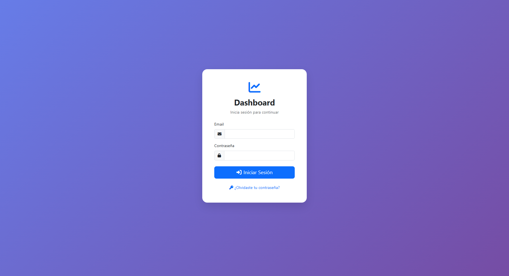
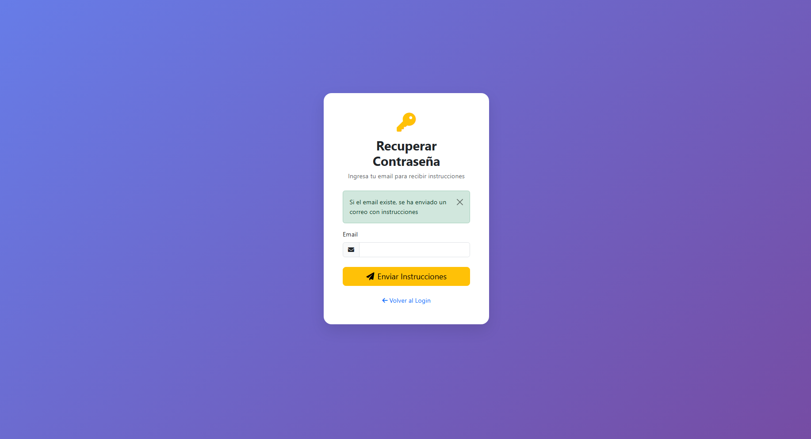
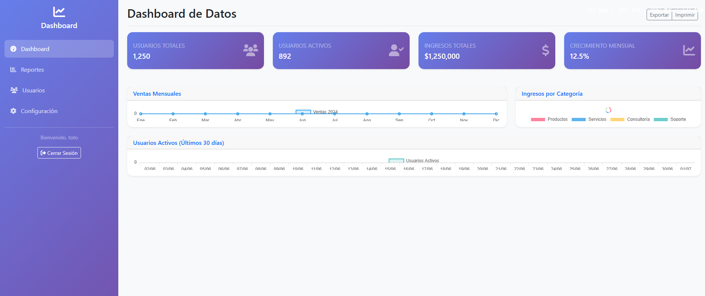

# Dashboard de Datos con Autenticación Django

Un dashboard moderno y responsive que muestra gráficos de datos estáticos con sistema de autenticación personalizado usando Django y encriptación con `django.core.signing`.





## 🚀 Características

- 🔐 **Autenticación personalizada** con encriptación usando `django.core.signing`
- 📧 **Login por email** en lugar de username
- 🔑 **Sistema de recuperación de contraseña** con tokens seguros y envío de emails
- 📊 **Dashboard interactivo** con gráficos usando Chart.js
- 🎨 **Interfaz moderna** con Bootstrap 5 y Font Awesome
- 📱 **Diseño responsive** que funciona en todos los dispositivos
- 🔄 **Datos dinámicos** cargados via AJAX
- 🛡️ **Tokens de seguridad** para reset de contraseña (24h de validez)

## 📁 Estructura del Proyecto

```
django/
├── dashboard/                 # Configuración principal del proyecto
│   ├── settings.py           # Configuración de Django y email
│   └── urls.py               # URLs principales
├── auth_app/                 # App de autenticación
│   ├── models.py            # Modelo CustomUser y PasswordResetToken
│   ├── views.py             # Vistas de autenticación
│   ├── urls.py              # URLs de autenticación
│   └── migrations/          # Migraciones de la base de datos
├── dashboard_app/           # App del dashboard
│   ├── views.py             # Vistas del dashboard y APIs
│   └── urls.py              # URLs del dashboard
├── templates/               # Templates HTML
│   ├── base.html           # Template base
│   ├── auth_app/           # Templates de autenticación
│   │   ├── login.html      # Formulario de login
│   │   ├── forgot_password.html # Solicitar reset
│   │   ├── reset_password.html  # Reset con token
│   │   └── email_reset_password.html # Template de email
│   └── dashboard_app/      # Templates del dashboard
├── static/                  # Archivos estáticos
├── create_user.py          # Script para crear usuarios
└── manage.py               # Script de gestión de Django
```

## ⚙️ Instalación y Uso

### 1. Instalar dependencias
```bash
pip install django
```

### 2. Configurar email (opcional)
Editar `dashboard/settings.py` y configurar las variables de email:
```python
EMAIL_HOST_USER = 'tu-email@gmail.com'
EMAIL_HOST_PASSWORD = 'tu-password-de-app'
DEFAULT_FROM_EMAIL = 'tu-email@gmail.com'
```

### 3. Ejecutar migraciones
```bash
python manage.py makemigrations
python manage.py migrate
```

### 4. Crear usuario de prueba
```bash
python create_user.py
```

### 5. Ejecutar el servidor
```bash
python manage.py runserver
```

### 6. Acceder al dashboard
- **URL:** http://127.0.0.1:8000/
- **Email:** `hflores@gmail.com`
- **Contraseña:** `test123`
- **Username:** `toto`

## 🔐 Sistema de Autenticación

### Login
- **URL:** `/auth/login/`
- **Método:** POST
- **Campos:** email, password
- **Validación:** Compara contraseña en texto plano con versión encriptada

### Recuperación de Contraseña
1. **Solicitar reset:** `/auth/forgot-password/`
   - Ingresa tu email
   - Sistema envía email con token único
   
2. **Reset con token:** `/auth/reset-password/<token>/`
   - Token válido por 24 horas
   - Un solo uso por token
   - Formulario con contraseña y confirmación

### Logout
- **URL:** `/auth/logout/`
- Redirige al login después de cerrar sesión

### API para Crear Usuarios
```bash
# Crear usuario via API
curl -X POST http://127.0.0.1:8000/auth/api/create-user/ \
  -H "Content-Type: application/json" \
  -d '{
    "username": "nuevo_usuario", 
    "password": "password123", 
    "email": "user@example.com"
  }'
```

## 📊 Dashboard

### Página Principal
- **URL:** `/dashboard/`
- Requiere autenticación
- Muestra estadísticas y gráficos

### APIs Disponibles
- **Estadísticas:** `/dashboard/api/stats/`
- **Gráficos:** `/dashboard/api/chart-data/?type=sales|users|revenue`

## 📈 Gráficos Disponibles

1. **Ventas Mensuales** (`type=sales`)
   - Gráfico de línea con datos de ventas del año
   - Datos de ejemplo: 12 meses de ventas

2. **Usuarios Activos** (`type=users`)
   - Gráfico de barras con usuarios activos
   - Últimos 30 días con datos aleatorios

3. **Ingresos por Categoría** (`type=revenue`)
   - Gráfico de dona con distribución de ingresos
   - Categorías: Productos, Servicios, Consultoría, Soporte, Otros

## 🔒 Encriptación de Contraseñas

### Características
- **Método:** `django.core.signing`
- **Validación:** Texto plano vs versión desencriptada
- **Compatibilidad:** Sistema estándar de Django
- **Seguridad:** Encriptación reversible pero segura

### Flujo de Validación
1. Usuario ingresa email y contraseña en texto plano
2. Sistema busca usuario por email
3. Encripta la contraseña ingresada
4. Compara con la contraseña almacenada en la base de datos
5. Si coinciden, permite el acceso

## 🛡️ Sistema de Tokens

### PasswordResetToken
- **Duración:** 24 horas
- **Uso:** Un solo uso por token
- **Generación:** UUID único
- **Almacenamiento:** Base de datos con timestamp

### Seguridad
- Tokens expiran automáticamente
- Se marcan como usados después del primer uso
- No se pueden reutilizar
- Protección contra ataques de fuerza bruta

## 📧 Configuración de Email

### Variables Requeridas
```python
EMAIL_BACKEND = 'django.core.mail.backends.smtp.EmailBackend'
EMAIL_HOST = 'smtp.gmail.com'
EMAIL_PORT = 587
EMAIL_USE_TLS = True
EMAIL_HOST_USER = 'tu-email@gmail.com'
EMAIL_HOST_PASSWORD = 'tu-password-de-app'
DEFAULT_FROM_EMAIL = 'tu-email@gmail.com'
```

### Template de Email
- **Archivo:** `templates/auth_app/email_reset_password.html`
- **Contenido:** HTML responsive con instrucciones
- **Enlace:** Token único para reset de contraseña

## 🛠️ Tecnologías Utilizadas

- **Backend:** Django 5.2.4
- **Base de datos:** SQLite
- **Frontend:** Bootstrap 5, Chart.js, Font Awesome
- **Autenticación:** Django Auth con modelo personalizado
- **Encriptación:** django.core.signing
- **Email:** SMTP con templates HTML

## 🔧 Desarrollo

### Agregar Nuevos Gráficos
1. Modificar `dashboard_app/views.py` para agregar nuevos endpoints
2. Actualizar `templates/dashboard_app/dashboard.html`
3. Agregar JavaScript correspondiente

### Modificar Autenticación
1. Editar `auth_app/models.py` para cambios en el modelo
2. Modificar `auth_app/views.py` para lógica de negocio
3. Actualizar templates en `templates/auth_app/`

### Crear Nuevos Usuarios
```python
# Usando el script
python create_user.py

# O programáticamente
from auth_app.models import CustomUser
user = CustomUser.objects.create_user(
    username='nuevo_usuario',
    email='email@ejemplo.com',
    password='contraseña'
)
```

## 🚨 Notas de Seguridad

- ✅ Contraseñas encriptadas con `django.core.signing`
- ✅ Validación de contraseñas en texto plano
- ✅ Protección CSRF en todos los formularios
- ✅ Sesiones seguras con Django
- ✅ Tokens únicos para reset de contraseña
- ✅ Expiración automática de tokens
- ✅ Validación de email en login

## 📝 Licencia

Este proyecto es de código abierto y está disponible bajo la licencia MIT.

## 🤝 Contribuciones

Las contribuciones son bienvenidas. Por favor, abre un issue o pull request para sugerencias y mejoras.
